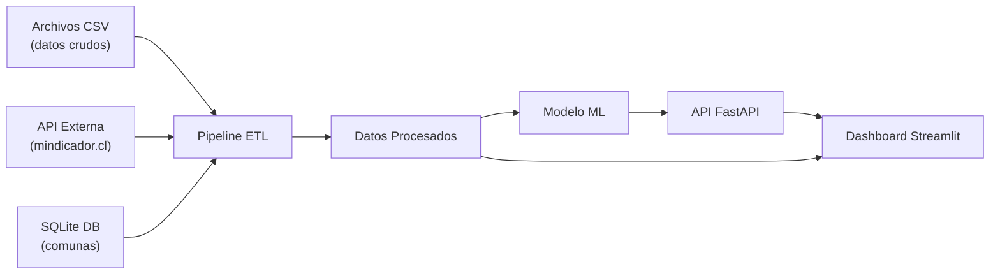

# Arquitectura del Proyecto

## Descripción General

Este proyecto predice precios de propiedades en Santiago de Chile usando datos scrapeados de portales inmobiliarios. La arquitectura sigue un flujo simple: se extraen los datos, se limpian, se entrenan modelos y se exponen a través de una API y un dashboard.

## Diagrama de Arquitectura



## Componentes

### Pipeline ETL

El pipeline ETL se encarga de:
- Leer los archivos CSV crudos desde `data/raw/`
- Obtener el valor de la UF desde la API de mindicador.cl
- Limpiar datos: sacar nulls, filtrar outliers, corregir tipos de datos
- Enriquecer con información de comunas desde la base SQLite
- Guardar los datos procesados en `data/processed/`

### API (FastAPI)

La API expone los modelos de predicción a través de endpoints REST:
- `GET /` - Información del proyecto y autores
- `GET /health` - Health check
- `GET /communes` - Lista de comunas disponibles
- `POST /predict` - Predicción de precio dado características de la propiedad

Corre en el puerto 8000.

### Dashboard (Streamlit)

El dashboard permite visualizar:
- Distribución de precios por comuna
- Mapa de calor de propiedades
- Formulario interactivo para hacer predicciones
- Gráficos comparativos

Corre en el puerto 8501.

## Stack Tecnológico

| Componente | Tecnología |
|---|---|
| Lenguaje | Python 3.11 |
| ETL | Pandas, Requests |
| Base de datos | SQLite |
| Modelo ML | Scikit-learn, XGBoost |
| API | FastAPI, Uvicorn |
| Dashboard | Streamlit, Plotly |
| Contenedores | Docker, Docker Compose |
| Control de versiones | Git, GitHub |

## Estructura de Carpetas

```
propiedades-chile/
├── api/                  # Código de la API
├── dashboards/           # Dashboard de Streamlit
├── data/
│   ├── raw/              # Datos crudos (CSVs)
│   └── processed/        # Datos limpios
├── docker/               # Dockerfiles y compose
├── docs/                 # Documentación
├── models/               # Modelos entrenados (.pkl)
├── notebooks/            # Jupyter notebooks
├── repo/                 # Docs de colaboración
├── src/                  # Código fuente (ETL, features)
└── tests/                # Tests del proyecto
```
